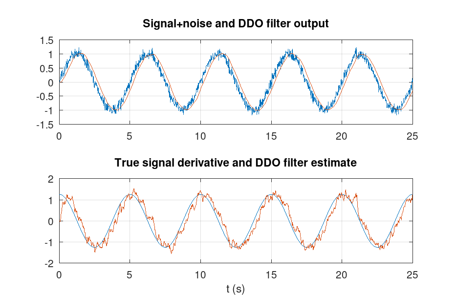

# DDOfilter - Driven Damped Oscillator filter

A driven damped oscillator system can be used as a low-pass signal filter that has the extra advantage of providing the 1st order time derivative of the signal; thus, it can also be used as a differentiator.

The following example shows a 0.2 Hz noizy signal filtered by a 1 Hz DDO. The bottom graph shows the signal derivative as obtained by the DDO. 



This project contains the following:
- [src/](./src/) A templated C++ class implementing the DDO filter, contained in [DDO.h](./src/DDO.h), and a command line filtering application [ddo.cpp](./src/ddo.cpp)
- [octave/](./octave/) A set of OCTAVE (https://www.octave.org) scripts for experimenting with the filter
- [doc/](./doc/) A LaTeX document with the mathematics

The project can be built with ``cmake``, preferably with the following commands
```
mkdir .build
cd .build
cmake ..
make (or nmake)
```
